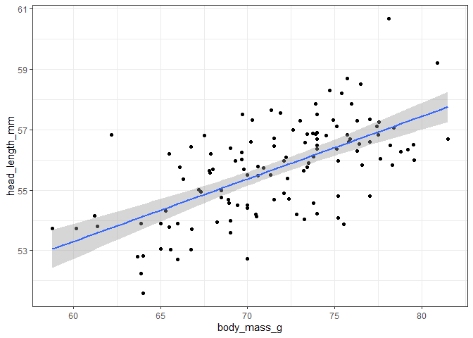

Visualizing trends
================

## Loading Data

## 1.0 Fitting linear trend lines with `geom_smooth`

``` r
ggplot(blue_jays) +
    aes(body_mass_g, head_length_mm) + 
    geom_point() +
    geom_smooth(method = 'lm'
               ) + 
  theme_bw()
```

    ## `geom_smooth()` using formula 'y ~ x'

<!-- -->

``` r
ggplot(blue_jays) +
    aes(body_mass_g, head_length_mm) + 
    geom_point() +
    geom_smooth(method = 'lm',
                se = FALSE) + 
  theme_bw()
```

    ## `geom_smooth()` using formula 'y ~ x'

<!-- -->

``` r
ggplot(blue_jays) +
    aes(body_mass_g, head_length_mm) + 
    geom_point() +
    geom_smooth(method = 'lm',
                se = FALSE,
                color = 'firebrick') + 
  theme_bw()
```

    ## `geom_smooth()` using formula 'y ~ x'

<!-- -->

``` r
ggplot(blue_jays) +
    aes(x = body_mass_g,
        y = head_length_mm, 
        color = sex) + 
    geom_point() +
    geom_smooth(method = 'lm',
                se = FALSE
                ) + 
  theme_bw()
```

    ## `geom_smooth()` using formula 'y ~ x'

<!-- -->

``` r
ggplot(blue_jays) +
    aes(x = body_mass_g,
        y = head_length_mm) + 
    geom_point() +
    geom_smooth(method = 'lm',
                se = FALSE
                ) + 
    facet_wrap(vars(sex))
```

    ## `geom_smooth()` using formula 'y ~ x'

<!-- -->

## 2.0 Linear trend lines in log-transformed data

### Data as-is

``` r
ggplot(biorxiv_growth, aes(date_dec, count)) +
  geom_point()
```

<!-- -->

``` r
ggplot(biorxiv_growth, aes(date_dec, count)) +
  geom_point() +
  geom_smooth(method = "lm") +
  scale_y_log10()
```

    ## `geom_smooth()` using formula 'y ~ x'

<!-- -->

### Creating a legend for the regression line

The trick is that we need to set up a placeholder mapping, such as
`aes(color = "original data")`. A mapping defined with `aes()` doesn’t
always have to refer to a data column in the original data, it can also
refer to a constant value provided with the mapping.

``` r
ggplot(biorxiv_growth, aes(date_dec, count)) +
  geom_point(aes(color = "original data")) +
  geom_smooth(aes(color = "regression line"), method = "lm") +
  scale_y_log10()
```

    ## `geom_smooth()` using formula 'y ~ x'

<!-- -->

``` r
ggplot(biorxiv_growth, aes(date_dec, count)) +
  geom_point(aes(color = "original data")) +
  geom_smooth(aes(color = "regression line"), method = "lm") +
  scale_y_log10() +
    scale_color_manual(
    name = NULL,
    values = c("black", "firebrick4"),
    guide = guide_legend(
      override.aes = list(
        linetype = c(0, 1),
        shape = c(19, NA)
      )
    )
  )
```

    ## `geom_smooth()` using formula 'y ~ x'

<!-- -->

## 3.0 Smoothing lines

``` r
ggplot(cars93, aes(Price, Fuel.tank.capacity)) +
  geom_point() + 
  geom_smooth()
```

    ## `geom_smooth()` using method = 'loess' and formula 'y ~ x'

<!-- -->

### Adjusting `span`

``` r
ggplot(cars93, aes(Price, Fuel.tank.capacity)) +
  geom_point() + 
  geom_smooth(
    span = 0.2
  )
```

    ## `geom_smooth()` using method = 'loess' and formula 'y ~ x'

<!-- -->

``` r
ggplot(cars93, aes(Price, Fuel.tank.capacity)) +
  geom_point() + 
  geom_smooth(
    span = 1.5
  )
```

    ## `geom_smooth()` using method = 'loess' and formula 'y ~ x'

<!-- -->

``` r
ggplot(cars93, aes(Price, Fuel.tank.capacity)) +
  geom_point() + 
  geom_smooth(
    method = "gam",
    formula = y ~ s(x, k = 3)
  )
```

<!-- -->
