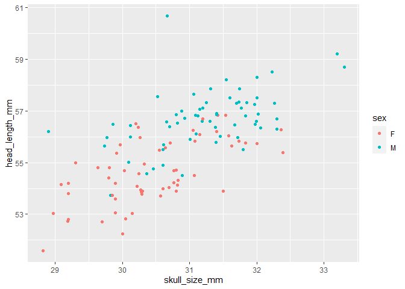
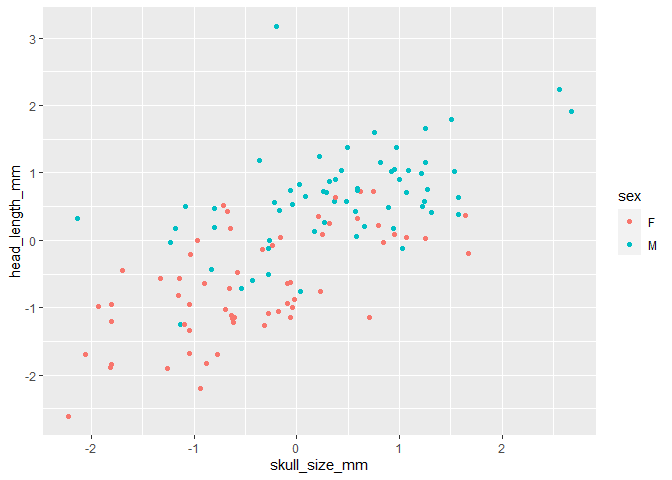
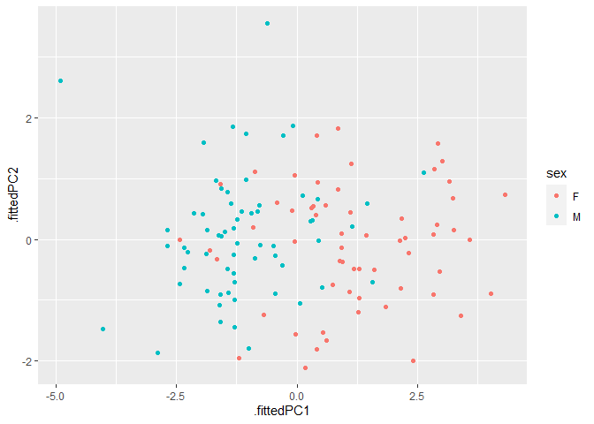
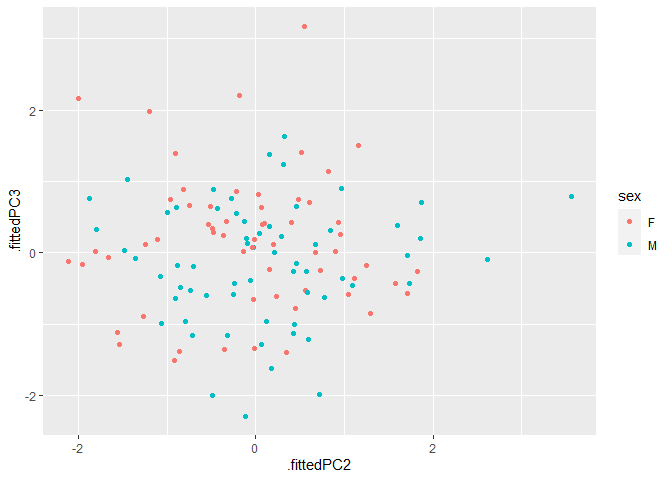
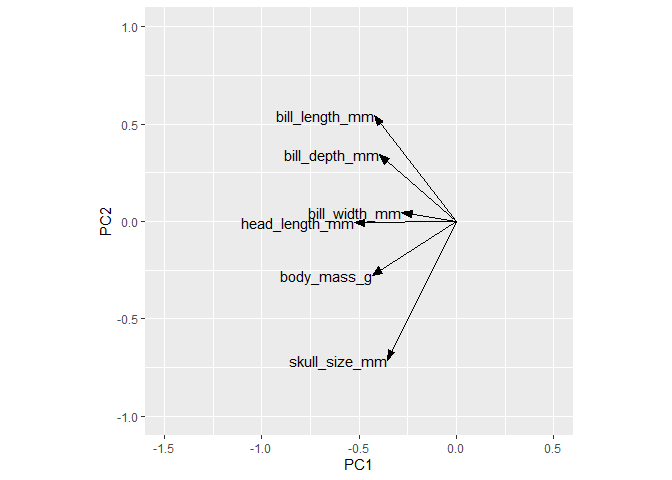
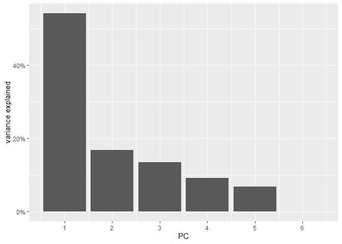

Dimension reduction 1
================

#### Reading data

``` r
blue_jays <- read_csv("https://wilkelab.org/SDS375/datasets/blue_jays.csv")
```

    ## Rows: 123 Columns: 8
    ## ── Column specification ────────────────────────────────────────────────────────
    ## Delimiter: ","
    ## chr (2): bird_id, sex
    ## dbl (6): bill_depth_mm, bill_width_mm, bill_length_mm, head_length_mm, body_...
    ## 
    ## ℹ Use `spec()` to retrieve the full column specification for this data.
    ## ℹ Specify the column types or set `show_col_types = FALSE` to quiet this message.

``` r
head(blue_jays)
```

    ## # A tibble: 6 × 8
    ##   bird_id    sex   bill_depth_mm bill_width_mm bill_le…¹ head_…² body_…³ skull…⁴
    ##   <chr>      <chr>         <dbl>         <dbl>     <dbl>   <dbl>   <dbl>   <dbl>
    ## 1 0000-00000 M              8.26          9.21      25.9    56.6    73.3    30.7
    ## 2 1142-05901 M              8.54          8.76      25.0    56.4    75.1    31.4
    ## 3 1142-05905 M              8.39          8.78      26.1    57.3    70.2    31.2
    ## 4 1142-05907 F              7.78          9.3       23.5    53.8    65.5    30.3
    ## 5 1142-05909 M              8.71          9.84      25.5    57.3    74.9    31.8
    ## 6 1142-05911 F              7.28          9.3       22.2    52.2    63.9    30  
    ## # … with abbreviated variable names ¹​bill_length_mm, ²​head_length_mm,
    ## #   ³​body_mass_g, ⁴​skull_size_mm

#### Plot without scaling

``` r
blue_jays %>%
  ggplot() +
  aes(skull_size_mm, head_length_mm) + 
  geom_point(aes(color = sex))
```

<!-- -->

#### Plot with scaling

``` r
blue_jays %>% 
  # scale all numeric columns
  mutate(across(where(is.numeric), scale)) %>%
  ggplot() +
  aes(skull_size_mm, head_length_mm) + 
  geom_point(aes(color = sex))
```

<!-- -->

#### Perform a PCA with `prcomp()`

``` r
blue_jays %>% 
  select(where(is.numeric)) %>% # retain only numeric columns
  scale() %>%                   # scale to zero mean and unit variance
  prcomp()                      # do PCA
```

    ## Standard deviations (1, .., p=6):
    ## [1] 1.801735505 1.001664889 0.898426518 0.736457067 0.633147386 0.001337779
    ## 
    ## Rotation (n x k) = (6 x 6):
    ##                       PC1          PC2         PC3         PC4          PC5
    ## bill_depth_mm  -0.3969857  0.342262537 -0.15267580  0.70664985  0.450105291
    ## bill_width_mm  -0.2810408  0.044926541  0.95822204  0.02838445 -0.001569506
    ## bill_length_mm -0.4209312  0.544180448 -0.13629166 -0.43921746 -0.141941341
    ## head_length_mm -0.5231576 -0.007875712 -0.14075388 -0.40403900  0.131442872
    ## body_mass_g    -0.4308880 -0.277787878 -0.12517605  0.35651048 -0.770973799
    ## skull_size_mm  -0.3561979 -0.712374529 -0.06666709 -0.12876761  0.406912265
    ##                          PC6
    ## bill_depth_mm  -0.0001782600
    ## bill_width_mm  -0.0001746131
    ## bill_length_mm -0.5431849028
    ## head_length_mm  0.7251949252
    ## body_mass_g     0.0002123608
    ## skull_size_mm  -0.4231339911

``` r
# First we run the PCA and store results as pca_fit:
pca_fit <- blue_jays %>% 
  select(where(is.numeric)) %>% # retain only numeric columns
  scale() %>%                   # scale to zero mean and unit variance
  prcomp() 
```

``` r
# Then we add PC coordinates into original dataset and plot:
pca_fit %>%
  augment(blue_jays) %>% # adds the fitted coordinates into the original dataset
  ggplot(aes(.fittedPC1, .fittedPC2)) +
  geom_point(aes(color = sex))
```

<!-- -->

#### Plot PC 2 against PC 1

``` r
pca_fit %>%
  # add PCs to the original dataset
  augment(blue_jays) %>%
  ggplot(aes(.fittedPC1, .fittedPC2)) +
  geom_point(aes(color = sex))
```

<!-- -->

#### Plot PC 3 against PC 2

``` r
pca_fit %>%
  # add PCs to the original dataset
  augment(blue_jays) %>%
  ggplot(aes(.fittedPC2, .fittedPC3)) +
  geom_point(aes(color = sex))
```

<!-- -->

#### Plot the rotation matrix

``` r
arrow_style <- arrow(
  angle = 20, length = grid::unit(8, "pt"),
  ends = "first", type = "closed"
)
pca_fit %>%
  # extract rotation matrix
  tidy(matrix = "rotation") %>%
  pivot_wider(
    names_from = "PC", values_from = "value",
    names_prefix = "PC"
  ) %>%
  ggplot(aes(PC1, PC2)) +
  geom_segment(
    xend = 0, yend = 0,
    arrow = arrow_style
  ) +
  geom_text(aes(label = column), hjust = 1) +
  xlim(-1.5, 0.5) + ylim(-1, 1) + 
  coord_fixed()
```

<!-- -->

#### Plot the Variance explained

``` r
pca_fit %>%
  # extract eigenvalues
  tidy(matrix = "eigenvalues") %>%
  ggplot(aes(PC, percent)) + 
  geom_col() + 
  scale_x_continuous(
    # create one axis tick per PC
    breaks = 1:6
  ) +
  scale_y_continuous(
    name = "variance explained",
    # format y axis ticks as percent values
    label = scales::label_percent(accuracy = 1)
  )
```

<!-- -->
