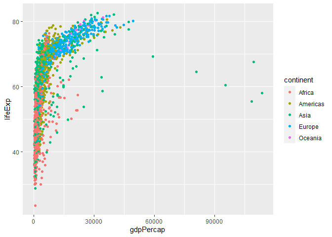
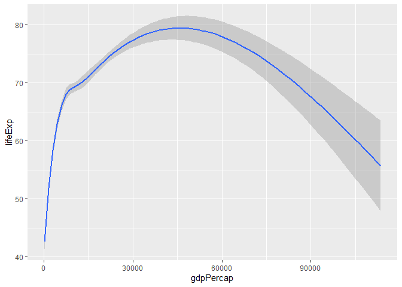
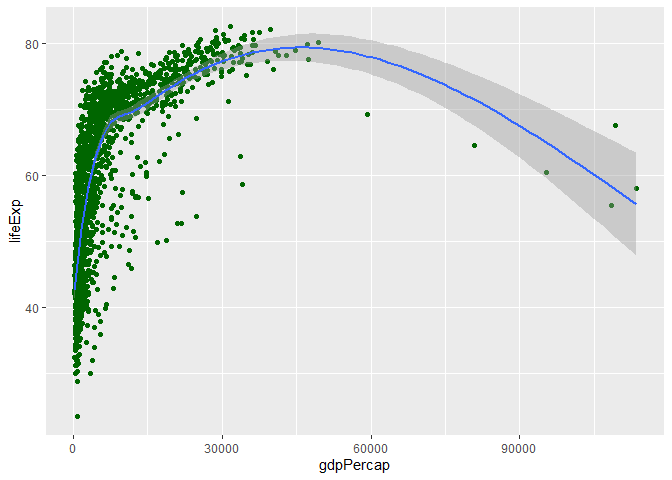
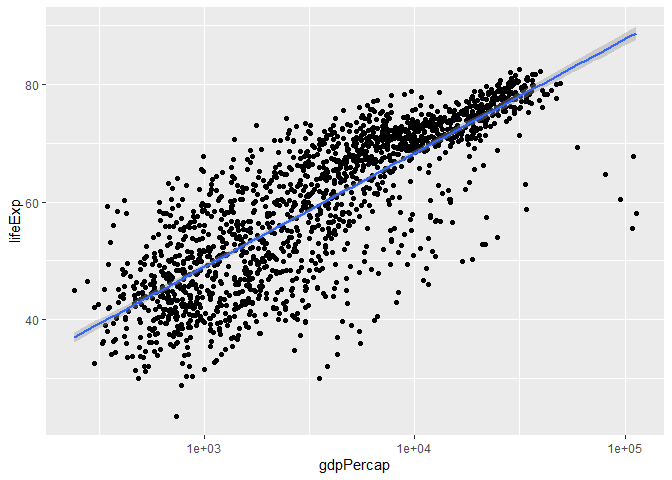
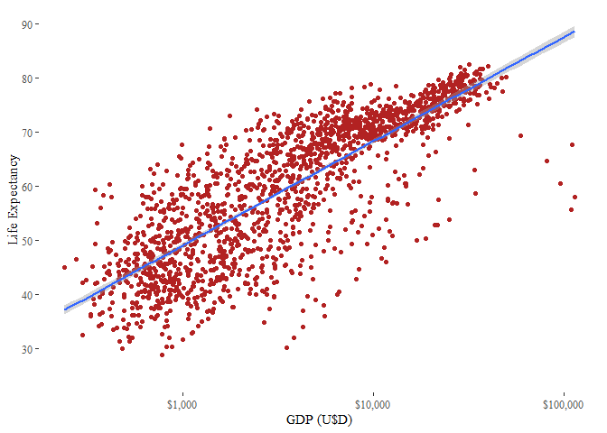
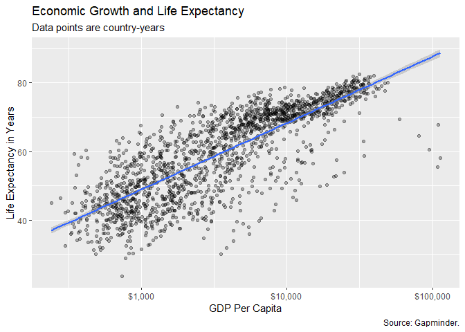
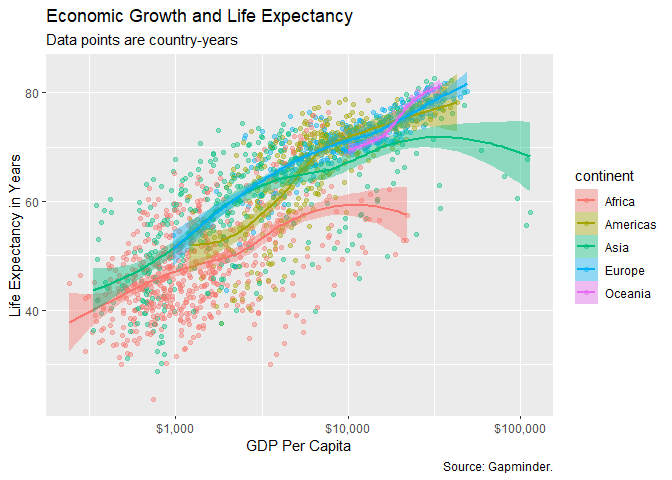
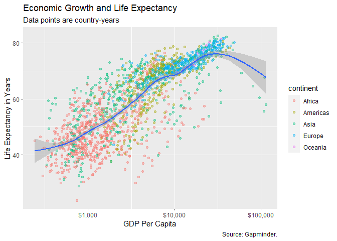
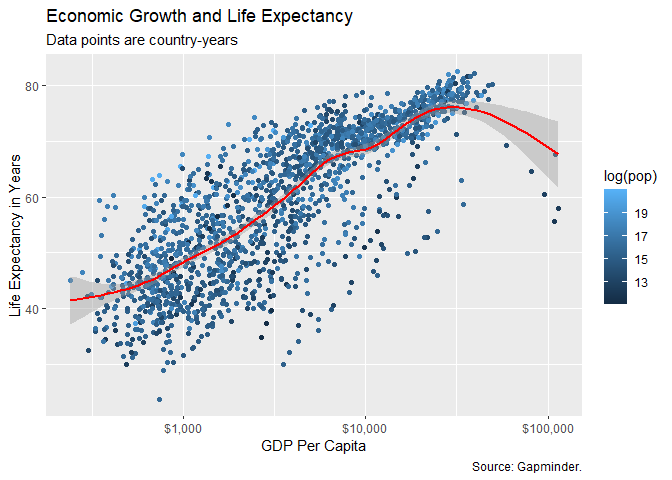

Intro to ggplot
================
By Lorenzo Peve

-   <a href="#10-load-libraries" id="toc-10-load-libraries">1.0 Load
    Libraries</a>
-   <a href="#20-view-at-gapminder-data"
    id="toc-20-view-at-gapminder-data">2.0 View at <em>gapminder</em>
    data</a>
-   <a href="#30-plotting-data" id="toc-30-plotting-data">3.0 Plotting
    Data</a>
    -   <a href="#31-most-basic-plot" id="toc-31-most-basic-plot">3.1 Most basic
        plot</a>
    -   <a href="#32-adding-color" id="toc-32-adding-color">3.2 Adding color</a>
    -   <a href="#33-smoothing" id="toc-33-smoothing">3.3 Smoothing</a>
    -   <a href="#34-smoothing-with-points"
        id="toc-34-smoothing-with-points">3.4 Smoothing with points</a>
    -   <a href="#35-transforming-x-axes" id="toc-35-transforming-x-axes">3.5
        Transforming x-axes.</a>
    -   <a href="#36-styling-axes" id="toc-36-styling-axes">3.6 Styling Axes</a>
    -   <a href="#37-a-more-stylish-plot-of-life-expectancy-vs-gdp"
        id="toc-37-a-more-stylish-plot-of-life-expectancy-vs-gdp">3.7 A more
        stylish plot of Life Expectancy vs GDP</a>
    -   <a href="#38-mapping-the-continent-variable"
        id="toc-38-mapping-the-continent-variable">3.8 Mapping the continent
        variable</a>
    -   <a href="#39-mapping-aestheticsper-geom"
        id="toc-39-mapping-aestheticsper-geom">3.9 Mapping Aestheticsper
        geom</a>
    -   <a href="#310-color-mapping-population"
        id="toc-310-color-mapping-population">3.10 Color mapping population</a>

## 1.0 Load Libraries

``` r
library(knitr)
library(ggplot2)
library(gapminder)
library(ggthemes)
```

## 2.0 View at *gapminder* data

``` r
gapminder
```

    ## # A tibble: 1,704 × 6
    ##    country     continent  year lifeExp      pop gdpPercap
    ##    <fct>       <fct>     <int>   <dbl>    <int>     <dbl>
    ##  1 Afghanistan Asia       1952    28.8  8425333      779.
    ##  2 Afghanistan Asia       1957    30.3  9240934      821.
    ##  3 Afghanistan Asia       1962    32.0 10267083      853.
    ##  4 Afghanistan Asia       1967    34.0 11537966      836.
    ##  5 Afghanistan Asia       1972    36.1 13079460      740.
    ##  6 Afghanistan Asia       1977    38.4 14880372      786.
    ##  7 Afghanistan Asia       1982    39.9 12881816      978.
    ##  8 Afghanistan Asia       1987    40.8 13867957      852.
    ##  9 Afghanistan Asia       1992    41.7 16317921      649.
    ## 10 Afghanistan Asia       1997    41.8 22227415      635.
    ## # … with 1,694 more rows

## 3.0 Plotting Data

Different plots are going to be created. I’ll start with the most basic
plot and then be be gradually increasing the number of components and
refining the graph to make the most effective visualization possible.

### 3.1 Most basic plot

``` r
p <- ggplot(data = gapminder,
            mapping = aes(x = gdpPercap,
                          y = lifeExp)) + geom_point()
p
```

<!-- -->

### 3.2 Adding color

``` r
p <- ggplot(data = gapminder,
            mapping = aes(x = gdpPercap,
                          y = lifeExp, color = continent)) + geom_point()
p
```

<!-- -->

### 3.3 Smoothing

`geom_smooth()` has calculated a smoothed line and added a shaded ribbon
showing the standard error for the line.

``` r
p <- ggplot(data = gapminder,
            mapping = aes(x = gdpPercap,
                          y=lifeExp))
p + geom_smooth()
```

<!-- -->

### 3.4 Smoothing with points

The order of the layers matter. We want points below the smoothing, so
they go first.

``` r
p + geom_point(color = '#006600') + geom_smooth()
```

<!-- -->

### 3.5 Transforming x-axes.

GDP is not normally distributed across the country years. The x-axis
scale would probably look better if it were transformed from a linear
scale to a log scale.

``` r
p <- ggplot(data = gapminder,
            mapping = aes(x = gdpPercap,
                          y=lifeExp))
p + geom_point() +
    geom_smooth(method = "lm") +
    scale_x_log10()
```

<!-- -->

### 3.6 Styling Axes

GDP is not normally distributed across the country years. The x-axis
scale would probably look better if it were transformed from a linear
scale to a log scale.

``` r
p <- ggplot(data = gapminder,
            mapping = aes(x = gdpPercap,
                          y=lifeExp))
p + geom_point(color = 'firebrick') +
    geom_smooth(method = "lm") +
    scale_x_log10(name = 'GDP (U$D)', 
                  labels = scales::dollar, 
                  breaks = waiver(),
                  minor_breaks= waiver()) + 
    scale_y_continuous(name = 'Life Expectancy',
                       limits = c(25, 90),
                       n.breaks = 6) +
    theme_tufte()
```

<!-- -->

### 3.7 A more stylish plot of Life Expectancy vs GDP

``` r
p <- ggplot(data = gapminder, mapping = aes(x = gdpPercap, y=lifeExp))
p + geom_point(alpha = 0.3) +
    geom_smooth(method = "lm") +
    scale_x_log10(labels = scales::dollar) +
    labs(x = "GDP Per Capita", y = "Life Expectancy in Years",
         title = "Economic Growth and Life Expectancy",
         subtitle = "Data points are country-years",
         caption = "Source: Gapminder.")
```

<!-- -->

### 3.8 Mapping the continent variable

``` r
p <- ggplot(data = gapminder, 
            mapping = aes(x = gdpPercap, 
                          y=lifeExp, 
                          color = continent,
                          fill = continent))
p + geom_point(alpha = 0.4) +
    geom_smooth() +
    scale_x_log10(labels = scales::dollar) +
    labs(x = "GDP Per Capita", y = "Life Expectancy in Years",
         title = "Economic Growth and Life Expectancy",
         subtitle = "Data points are country-years",
         caption = "Source: Gapminder.")
```

<!-- -->

### 3.9 Mapping Aestheticsper geom

Five separate smoothers is too many but we still want to show the
smoothed line. By default, **geoms** inherit their mappings from the
`ggplot()` function.

``` r
p <- ggplot(data = gapminder, 
            mapping = aes(x = gdpPercap, 
                          y=lifeExp))
p + geom_point(mapping = aes(color = continent), alpha = 0.4) +
    geom_smooth() +
    scale_x_log10(labels = scales::dollar) +
    labs(x = "GDP Per Capita", y = "Life Expectancy in Years",
         title = "Economic Growth and Life Expectancy",
         subtitle = "Data points are country-years",
         caption = "Source: Gapminder.")
```

<!-- -->

### 3.10 Color mapping population

``` r
p <- ggplot(data = gapminder, 
            mapping = aes(x = gdpPercap, 
                          y=lifeExp))
p + geom_point(mapping = aes(color = log(pop)), alpha = 1) +
    geom_smooth(color = 'red') +
    scale_x_log10(labels = scales::dollar) +
    labs(x = "GDP Per Capita", y = "Life Expectancy in Years",
         title = "Economic Growth and Life Expectancy",
         subtitle = "Data points are country-years",
         caption = "Source: Gapminder.")
```

<!-- -->
