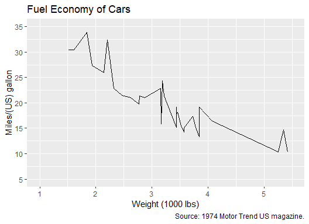
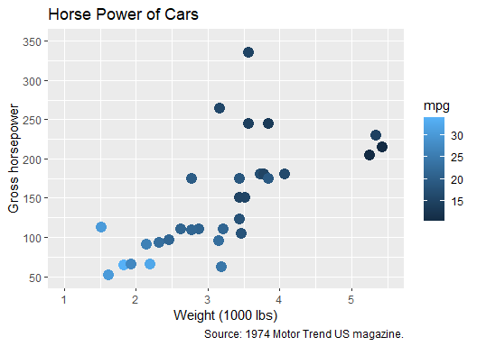

Project 1
================

**Part 1:** Demonstrate basic command of Markdown by creating a bulleted
list with three items, a numbered list with three items, and a sentence
that has one word in bold and one word in italics.

A few distinct characteristics of `ggplot2` compared to other libraries
is that `ggplot2` :

-   Has an underlying *grammar* based on the **Grammar of Graphics**
    that allows you to compose graphs by combining independent
    components;
-   Works iteratively by starting with the raw data and then a sequence
    of logical steps that add to the structure of the plot;
-   Has carefully chosen default values that can produce
    publication-quality graphics with a single function.

The process of making plots using `ggplot()` can be explained by three
distinct steps:

1.  Provide the data and specify the mapping
    -   1.1 Data is generally provided as a dataframe
    -   1.2 The mapping is done with the function `aes()` that connects
        variables in the dataframe to aesthetics (position in x or y,
        color, shape, size, etc)
2.  Specify which type of plot you want. How do you want `ggplot()` to
    draw the data.
    -   Functions like `geom_point()` or `geom_line()` are used in this
        step.
    -   Arguments can be passed to the `geom_`
3.  Use of additional functions can be used to adjust scales, labels,
    tick marks, and or titles.

It is noted that with only Steps 1 and 2 there is enough information for
`ggplot()` to draw a **plot**. If you don’t provide anything else
`ggplot()` will use *carefully* designed defaults.

**Part 2:** The `mtcars` dataset contains information on car design and
performance in 1974:

``` r
show(head(mtcars))
```

    ##                    mpg cyl disp  hp drat    wt  qsec vs am gear carb
    ## Mazda RX4         21.0   6  160 110 3.90 2.620 16.46  0  1    4    4
    ## Mazda RX4 Wag     21.0   6  160 110 3.90 2.875 17.02  0  1    4    4
    ## Datsun 710        22.8   4  108  93 3.85 2.320 18.61  1  1    4    1
    ## Hornet 4 Drive    21.4   6  258 110 3.08 3.215 19.44  1  0    3    1
    ## Hornet Sportabout 18.7   8  360 175 3.15 3.440 17.02  0  0    3    2
    ## Valiant           18.1   6  225 105 2.76 3.460 20.22  1  0    3    1

Use ggplot to make a line plot of the fuel economy of a car, measured in
miles/gallon (column `mpg`), versus its weight (column `wt`).

``` r
p <- ggplot(data = mtcars, 
            mapping = aes(x = wt, 
                          y=mpg))
p + geom_line() + 
scale_y_continuous(limits = c(5, 35), breaks = seq(5, 35, by=5)) + 
scale_x_continuous(limits = c(1, 5.5), breaks = seq(1, 5.5, by=1)) +
labs(x = "Weight (1000 lbs)", y = "Miles/(US) gallon",
     title = "Fuel Economy of Cars",
     caption = "Source: 1974 Motor Trend US magazine.")
```



Now make a scatter plot (using `geom_point()`) of the horse power of a
car (`hp`) versus its weight, and color points by its fuel economy.

``` r
p <- ggplot(data = mtcars,
            mapping = aes(x = wt,
                          y=hp,
                          color = mpg))
p + geom_point(size = 4) +
scale_y_continuous(limits = c(50, 350), breaks = seq(50, 350, by=50)) +
scale_x_continuous(limits = c(1, 5.5), breaks = seq(1, 5.5, by=1)) +
labs(x = "Weight (1000 lbs)", y = "Gross horsepower",
     title = "Horse Power of Cars",
     caption = "Source: 1974 Motor Trend US magazine.")
```


