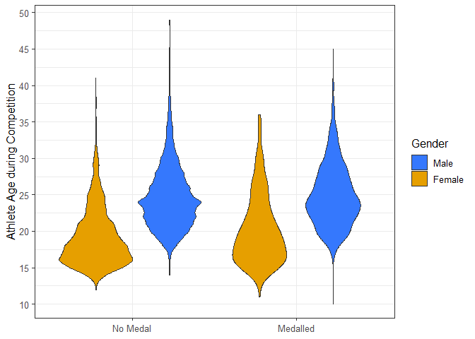
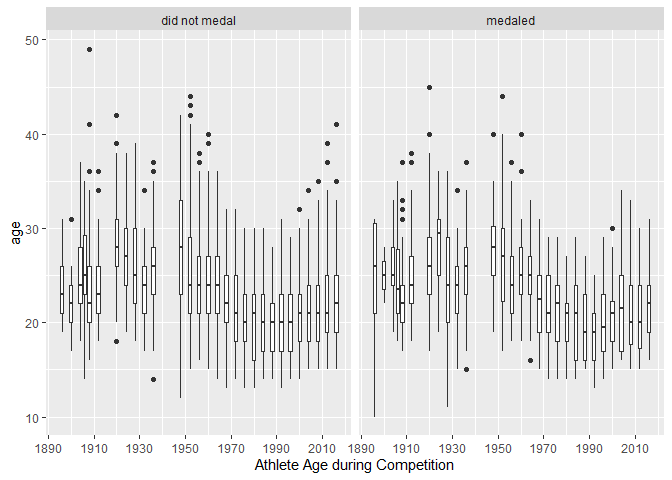

Project 2
================

This is the dataset for the project:

``` r
olympics <- readr::read_csv('https://raw.githubusercontent.com/rfordatascience/tidytuesday/master/data/2021/2021-07-27/olympics.csv')

olympic_gymnasts <- olympics %>% 
  filter(!is.na(age)) %>%             # only keep athletes with known age
  filter(sport == "Gymnastics") %>%   # keep only gymnasts
  mutate(
    medalist = case_when(             # add column for success in medaling
      is.na(medal) ~ FALSE,           # NA values go to FALSE
      !is.na(medal) ~ TRUE            # non-NA values (Gold, Silver, Bronze) go to TRUE
    )
  )
olympic_gymnasts
```

    ## # A tibble: 25,528 × 16
    ##       id name     sex     age height weight team  noc   games  year season city 
    ##    <dbl> <chr>    <chr> <dbl>  <dbl>  <dbl> <chr> <chr> <chr> <dbl> <chr>  <chr>
    ##  1    17 Paavo J… M        28    175     64 Finl… FIN   1948…  1948 Summer Lond…
    ##  2    17 Paavo J… M        28    175     64 Finl… FIN   1948…  1948 Summer Lond…
    ##  3    17 Paavo J… M        28    175     64 Finl… FIN   1948…  1948 Summer Lond…
    ##  4    17 Paavo J… M        28    175     64 Finl… FIN   1948…  1948 Summer Lond…
    ##  5    17 Paavo J… M        28    175     64 Finl… FIN   1948…  1948 Summer Lond…
    ##  6    17 Paavo J… M        28    175     64 Finl… FIN   1948…  1948 Summer Lond…
    ##  7    17 Paavo J… M        28    175     64 Finl… FIN   1948…  1948 Summer Lond…
    ##  8    17 Paavo J… M        28    175     64 Finl… FIN   1948…  1948 Summer Lond…
    ##  9    17 Paavo J… M        32    175     64 Finl… FIN   1952…  1952 Summer Hels…
    ## 10    17 Paavo J… M        32    175     64 Finl… FIN   1952…  1952 Summer Hels…
    ## # … with 25,518 more rows, and 4 more variables: sport <chr>, event <chr>,
    ## #   medal <chr>, medalist <lgl>

More information about the dataset can be found at
<https://github.com/rfordatascience/tidytuesday/tree/master/data/2021/2021-07-27/readme.md>
and <https://www.sports-reference.com/olympics.html>.

## **Question:**

Are there age differences for male and female Olympic gymnasts who were
successful or not in earning a medal, and how has the age distribution
changed over the years?

## **Introduction:**

This project uses a subset of the historical dataset on the modern
**Olympic Games** (including all the Games from Athens 1896 to Rio 2016)
by focusing on gymnasts. `olympic_gymnasts` contains all the records
from the original **Olympic Games** dataset where the sport is equal to
“Gymnastics”. In this dataset, each row corresponds to the participation
of an Olympic athlete in an Olympic event.

It is noted that an athlete is allowed to participate in multiple events
during the same Olympic Games. Thus, the same athlete (id, name, sex,
age, height, team, noc) is repeated for those athletes that took part in
different competitions during the same Games.

It is also important to highlight that the athlete data (age, height,
weight) correspond to the time of the competition. Athletes that took
part in more than one Game, have larger ages for more recent Games
(i.e., naturally aging).

There are 16 columns providing information about the athlete and their
participation/performance. Information about the athlete includes:

- id, sex, age, height, weight, team, and nationality.

Information about the athlete participation/performance includes:

- game’s name, year, season, city
- athlete’s sport/discipline, event, medal
- whether the athlete was a medalist.

## **Approach:**

The approach to evaluating differences between male and female Olympic
gymnasts while distinguishing those with medals and those without
consisted of using violin plots (`geom_violin()`).

To evaluate how has the age distribution changed over the years, a
facetted boxplot is used.

## **Analysis:**

### 1.0 Data Validation.

Check there are no missing values.

``` r
unique(olympic_gymnasts$sex)
```

    ## [1] "M" "F"

``` r
unique(olympic_gymnasts$medalist)
```

    ## [1]  TRUE FALSE

Get range of ages

``` r
summary(olympic_gymnasts$age)
```

    ##    Min. 1st Qu.  Median    Mean 3rd Qu.    Max. 
    ##   10.00   19.00   22.00   22.73   26.00   49.00

### 2.0 Violin Plots

``` r
ggplot(olympic_gymnasts, aes(x = medalist, y = age, fill = sex)) +
geom_violin() + 
scale_x_discrete(name = NULL,
                 labels = c("No Medal", "Medalled")) +
scale_y_continuous(breaks= seq(from = 10, to = 50, by = 5),
                  name = 'Athlete Age during Competition') +
scale_fill_manual(name = 'Gender',
                  labels = c("Male", "Female"),
                  values = c(`M` = "#3578FD", `F` = "#E69F00")
  ) +
theme_bw(12)
```

<!-- -->

### 3.0 Box Plots

``` r
ggplot(olympic_gymnasts, aes(x = year, y = age, group = year)) +
geom_boxplot() + 

facet_wrap(vars(medalist), 
           labeller = as_labeller(c(`TRUE` = "medaled", `FALSE` = "did not medal")) ) +
scale_x_continuous(breaks= seq(from = 1890, to = 2030, by = 20),
                  name = 'Athlete Age during Competition')
```

<!-- -->

## **Discussion:**

Interestingly, gymnast’s “medalling” status does not affect the age
distribution within a particular gender. We can see this by comparing
the violins with the same color and seeing that each pair has a similar
shape and expected values. Hence, comparisons are made for gender only.
For both medalled and not medalled athletes, the expected value for the
age of an Olympic women athlete is considerably smaller than that of
males, with women on average being eight years younger than male
competitors. Besides, looking at the shape of the distribution, it seems
that the age of male participants resembles more closely a bell-shape
curved. In contrast, the distribution of age in female participants is
more right-skewed, with a bigger proportion of younger athletes.

The distribution of the age of Olympic gymnasts doesn’t exhibit a
difference in the trend when distinguished by medalling status. As seen
in both subplots, the trend is for ages to decrease since the 1960’s and
remain about 20 years old for the last 30 years. However, the
distribution of ages for non-medallist athletes is more spread, as
indicated by the length of the boxplot’s fence lines.
