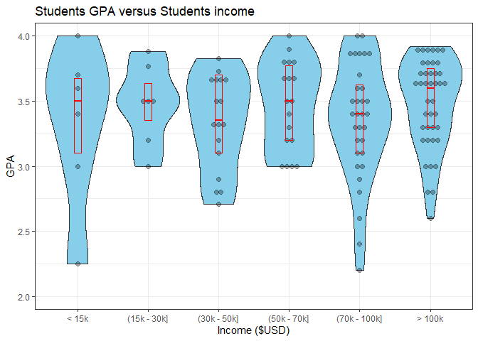
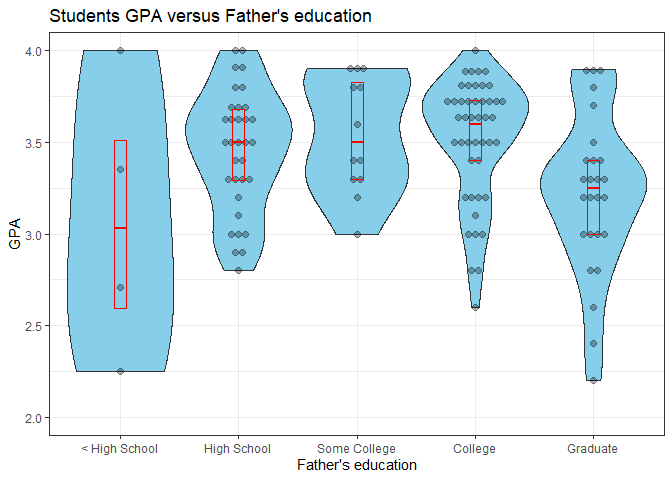
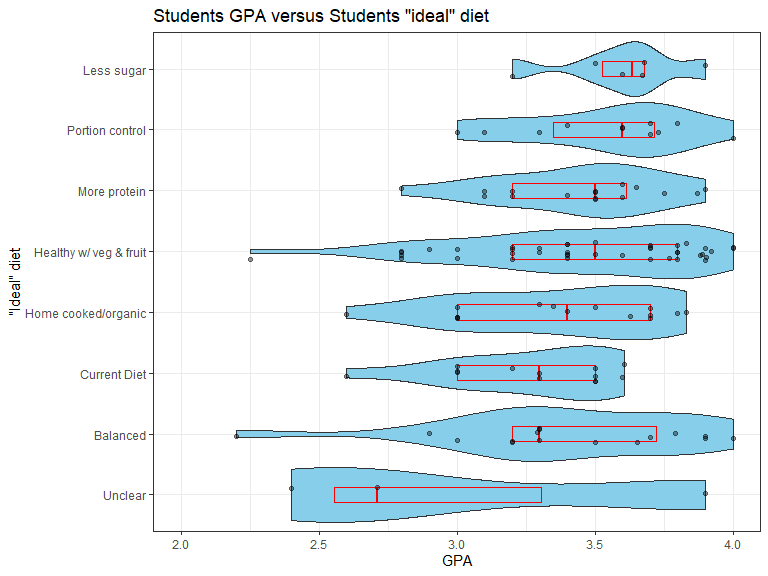

Students GPA against 3 explanatory variables
================

This is the dataset we will be working with:

``` r
food <- readr::read_csv(
  "https://wilkelab.org/DSC385/datasets/food_coded.csv",
  na = c("Unknown", "nan", "Personal"))
food
```

    ## # A tibble: 125 × 61
    ##    GPA   Gender breakfast calor…¹ calor…² calor…³ coffee comfo…⁴ comfo…⁵ comfo…⁶
    ##    <chr>  <dbl>     <dbl>   <dbl>   <dbl>   <dbl>  <dbl> <chr>   <chr>     <dbl>
    ##  1 2.4        2         1     430      NA     315      1 none    we don…       9
    ##  2 3.654      1         1     610       3     420      2 chocol… Stress…       1
    ##  3 3.3        1         1     720       4     420      2 frozen… stress…       1
    ##  4 3.2        1         1     430       3     420      2 Pizza,… Boredom       2
    ##  5 3.5        1         1     720       2     420      2 Ice cr… Stress…       1
    ##  6 2.25       1         1     610       3     980      2 Candy,… None, …       4
    ##  7 3.8        2         1     610       3     420      2 Chocol… stress…       1
    ##  8 3.3        1         1     720       3     420      1 Ice cr… I eat …       1
    ##  9 3.3        1         1     430      NA     420      1 Donuts… Boredom       2
    ## 10 3.3        1         1     430       3     315      2 Mac an… Stress…       1
    ## # … with 115 more rows, 51 more variables: cook <dbl>,
    ## #   comfort_food_reasons_coded...12 <dbl>, cuisine <dbl>, diet_current <chr>,
    ## #   diet_current_coded <dbl>, drink <dbl>, eating_changes <chr>,
    ## #   eating_changes_coded <dbl>, eating_changes_coded1 <dbl>, eating_out <dbl>,
    ## #   employment <dbl>, ethnic_food <dbl>, exercise <dbl>,
    ## #   father_education <dbl>, father_profession <chr>, fav_cuisine <chr>,
    ## #   fav_cuisine_coded <dbl>, fav_food <dbl>, food_childhood <chr>, …

A detailed data dictionary for this dataset is available
[here.](https://wilkelab.org/DSC385/datasets/food_codebook.pdf) The
dataset was originally downloaded from Kaggle, and you can find
additional information about the dataset
[here.](https://www.kaggle.com/borapajo/food-choices/version/5)

## **Question:**

Is GPA related to student income, the father’s educational level, or the
student’s perception of what an ideal diet is?

## **Introduction:**

Introduction: We are working with a subset of the food choices and
preferences of college students’ dataset, which contains responses from
126 students of *Mercyhurst University* who agreed to participate in a
survey. While the original dataset has 61 variables, this analysis
focuses on four variables: (1) GPA, (2) student income, (3) the father’s
educational level, and (4) the student’s perception of what an ideal
diet is.

`GPA` is provided as a numeric value on a scale from 1.0 to 4.0
(unitless).

`income` is encoded as a numeric variable with values of 1 to 6 as
follows:

- 1 -\> less than \$15,000
- 2 -\> \$15,001 to \$30,000
- 3 -\> \$30,001 to \$50,000
- 4 -\> \$50,001 to \$70,000
- 5 -\> \$70,001 to \$100,000
- 6 -\> higher than \$100,000

`father_education` is encoded as a numeric variable with values of 1 to
5 as follows:

- 1 -\> less than high school
- 2 -\> high school degree
- 3 -\> some college degree
- 4 -\> college degree
- 5 -\> graduate degree

The student’s perception of what an ideal diet is `ideal_diet_coded` is
encoded as a numeric variable with values of 1 to 8 as follows:

- 1 -\> portion control
- 2 -\> adding veggies/eating healthier food/adding fruit 3 – balance
- 4 -\> less sugar
- 5 -\> home cooked/organic
- 6 -\> current diet
- 7 -\> more protein
- 8 -\> unclear

## **Approach:**

The approach used for this analysis is to show the distributions of GPA
versus the other explanatory variables using violin plots that include
the data points and also summary statistics (25, 50, and 75% quartiles).
Violins make it easy to compare multiple distributions side-by-side.
However, since they do not show the number of observations and the
categories have distinct sample sizes, the data points are plotted with
jittering for a more realistic representation of the data. Summary
statistics are also added to allow for a quick comparison among the
groups.

Boxplots alone were considered inadequate to provide a good
representation of the data because of the distinct sample sizes in each
group and the different variability among groups.

Data preparation steps included:

- Transformation of numeric codes to categorical values represented by
  humanly readable words or phrases (`income` and `father_education`).
- Conversion of character strings into numerical values for `GPA` with
  some string manipulations to account for NA values.
- Arrangement of categorical variables into “natural” order for `income`
  and `father_education`.

Plots for `income` and `father_education`maintain the “inherent” or
natural order of the variable whereas for the `ideal_diet_coded` the
groups are arranged in decreasing average value from top to bottom.

## **Analysis:**

### 1.0 Data Inspection

``` r
# Get only the four columns of interest
food <- food[c("GPA","income","father_education", "ideal_diet_coded")]
colnames(food)
```

    ## [1] "GPA"              "income"           "father_education" "ideal_diet_coded"

#### 1.1 `GPA`

Missing values encoded as `"Unknown"`, `"nan"`, or `"Personal"` where
parsed as valid `NAs` at reading time. However, one more entry has an
invalid string, which is handled below.

``` r
food$GPA <- sub(' bitch','',food$GPA)
```

Convert to numeric

``` r
food$GPA <- as.numeric(food$GPA)
```

Summary Stats

``` r
summary(food$GPA)
```

    ##    Min. 1st Qu.  Median    Mean 3rd Qu.    Max.    NA's 
    ##   2.200   3.200   3.500   3.419   3.700   4.000       4

#### 1.2 `income`

Categories are re-coded following the data dictionary.

``` r
# Unique values
sort(unique(food$income), na.last = TRUE)
```

    ## [1]  1  2  3  4  5  6 NA

``` r
food <- food %>%
  mutate(
    income = case_when(
      income == 1 ~ "< 15k",
      income == 2 ~ "(15k - 30k]",
      income == 3 ~ "(30k - 50k]",
      income == 4 ~ "(50k - 70k]",
      income == 5 ~ "(70k - 100k]",
      income == 6 ~ "> 100k"
    )
  )
food$income<- fct_relevel(as.factor(food$income),
                             "< 15k", "(15k - 30k]", "(30k - 50k]",
                             "(50k - 70k]", "(70k - 100k]","> 100k")
unique(food$income)
```

    ## [1] (70k - 100k] (50k - 70k]  > 100k       < 15k        (30k - 50k] 
    ## [6] (15k - 30k]  <NA>        
    ## Levels: < 15k (15k - 30k] (30k - 50k] (50k - 70k] (70k - 100k] > 100k

``` r
table(food$income, useNA = "ifany")
```

    ## 
    ##        < 15k  (15k - 30k]  (30k - 50k]  (50k - 70k] (70k - 100k]       > 100k 
    ##            6            7           17           20           33           41 
    ##         <NA> 
    ##            1

#### 1.3 `father_education`

Categories are re-coded following the data dictionary.

``` r
# Unique values
sort(unique(food$father_education), na.last = TRUE)
```

    ## [1]  1  2  3  4  5 NA

``` r
food <- food %>%
  mutate(
    father_education = case_when(
      father_education == 1 ~ "< High School",
      father_education == 2 ~ "High School",
      father_education == 3 ~ "Some College",
      father_education == 4 ~ "College",
      father_education == 5 ~ "Graduate",
    )
  )
food$father_education<- fct_relevel(as.factor(food$father_education),
                             "< High School", "High School","Some College",
                             "College", "Graduate")
unique(food$father_education)
```

    ## [1] Graduate      High School   College       < High School Some College 
    ## [6] <NA>         
    ## Levels: < High School High School Some College College Graduate

``` r
table(food$father_education, useNA = "ifany")
```

    ## 
    ## < High School   High School  Some College       College      Graduate 
    ##             4            34            12            46            28 
    ##          <NA> 
    ##             1

#### 1.4 `ideal_diet_coded`

Categories are re-coded following the data dictionary.

``` r
# Unique values
sort(unique(food$ideal_diet_coded), na.last = TRUE)
```

    ## [1] 1 2 3 4 5 6 7 8

``` r
food <- food %>%
  mutate(
    ideal_diet_coded = case_when(
      ideal_diet_coded == 1 ~ "Portion control",
      ideal_diet_coded == 2 ~ "Healthy w/ veg & fruit",
      ideal_diet_coded == 3 ~ "Balanced",
      ideal_diet_coded == 4 ~ "Less sugar",
      ideal_diet_coded == 5 ~ "Home cooked/organic",
      ideal_diet_coded == 6 ~ "Current Diet",
      ideal_diet_coded == 7 ~ "More protein",
      ideal_diet_coded == 8 ~ "Unclear",
    )
  )
unique(food$ideal_diet_coded)
```

    ## [1] "Unclear"                "Balanced"               "Current Diet"          
    ## [4] "Healthy w/ veg & fruit" "More protein"           "Portion control"       
    ## [7] "Home cooked/organic"    "Less sugar"

``` r
table(food$ideal_diet_coded, useNA = "ifany")
```

    ## 
    ##               Balanced           Current Diet Healthy w/ veg & fruit 
    ##                     17                     13                     44 
    ##    Home cooked/organic             Less sugar           More protein 
    ##                     15                      6                     16 
    ##        Portion control                Unclear 
    ##                     11                      3

### 2.0 Data Visualization

#### 2.1 GPA vs Income

``` r
food %>%
  filter(!is.na(GPA), !is.na(income) ) %>%
  
  ggplot(aes(x = income, y = GPA)) + 
  geom_violin(scale = "width", fill = 'skyblue') +  
  geom_dotplot(binaxis='y', stackdir='center', dotsize=0.5, binwidth = 0.075,  alpha = 0.3) + 
  geom_boxplot(width=0.1, coef = 0, fill = NA, color = 'red', outlier.shape = NA) +
  
  # Aesthetics
  scale_y_continuous('GPA',  breaks= seq(from = 1, to = 4, by = 0.5), limits = c(2,4)) +
  labs(title = 'Students GPA versus Students income') + 
  xlab('Income ($USD)') +
  theme_bw()
```

<!-- -->

#### 2.2 GPA vs Father’s education

``` r
food %>%
  filter(!is.na(GPA), !is.na(father_education) ) %>%
  
  ggplot(aes(x = father_education, y = GPA)) + 
  geom_violin(scale = "width", fill = 'skyblue') +  
  geom_dotplot(binaxis='y', stackdir='center', dotsize=0.5, binwidth = 0.075, alpha = 0.3) + 
  geom_boxplot(width=0.1, coef = 0, fill = NA, color = 'red', outlier.shape = NA) +
  
  # Aesthetics
  scale_y_continuous('GPA',  breaks= seq(from = 1, to = 4, by = 0.5), limits = c(2,4)) +
  labs(title = "Students GPA versus Father's education") + 
  xlab("Father's education") +
  theme_bw()
```

<!-- -->

#### 2.3 GPA vs Student’s idea of an ideal diet

``` r
food %>%
  filter(!is.na(GPA), !is.na(ideal_diet_coded) ) %>%
    mutate(ideal_diet_coded = fct_reorder(ideal_diet_coded, GPA, median)) %>%

  ggplot(aes(y = ideal_diet_coded, x = GPA)) + 
  geom_violin(scale = "width", fill = 'skyblue') +
  geom_boxplot(width=0.25, coef = 0, fill = NA, color = 'red', outlier.shape = NA) +
  geom_point(size = 1.5, 
             color = 'black', alpha = 0.4,
             position = position_jitter(width = 0, height =0.15)) +
  
  # Aesthetics
  scale_x_continuous('GPA',  breaks= seq(from = 1, to = 4, by = 0.5), limits = c(2,4)) +
  labs(title = 'Students GPA versus Students "ideal" diet') + 
  ylab('"Ideal" diet') +
  theme_bw()
```

<!-- -->

``` r
food %>% 
  group_by(ideal_diet_coded) %>% 
  summarize(avgGPA = median(GPA, na.rm = TRUE)) %>% 
arrange(avgGPA)
```

    ## # A tibble: 8 × 2
    ##   ideal_diet_coded       avgGPA
    ##   <chr>                   <dbl>
    ## 1 Unclear                  2.71
    ## 2 Balanced                 3.3 
    ## 3 Current Diet             3.3 
    ## 4 Home cooked/organic      3.4 
    ## 5 Healthy w/ veg & fruit   3.5 
    ## 6 More protein             3.5 
    ## 7 Portion control          3.6 
    ## 8 Less sugar               3.64

## **Discussion:**

*GPA and Income*

Students’ GPA seems to be independent of students income. There doesn’t
appear to be a trend in the data as the average GPA increases and
decreases across the groups. For example, the average GPA for the
70k-100k group is lower than the 15k-30k and 50k-70k and the average GPA
for the 30k-50k group is lower than the 15k-30k and \<15k groups.
Besides, there is also no clear trend on how the variability changes as
income changes. It is not possible to compare the variability between
the two lowest and two largest income groups because of their
differences in the sample sizes of 6 and 7 compared to 33, and 41,
respectively.

*GPA and Father’s education*

Students’ average GPA seems to be independent of their father’s
education. In other words, there is no apparent trend as we move towards
more educated fathers because the average GPA increases for students
whose fathers have college degrees but then drops below 3.5 for students
whose parents have graduate degrees. The “Less than High School”
category cannot be compared to the others because of the sample size of
4.

The variability in GPA is higher for students whose fathers have college
and graduate degrees than for students whose fathers have either high
school or some college degree.

*GPA and Diet*

Establishing relationships between GPA and the “ideal” diet for the
surveyed students is challenging because of the subjectivity in the
categories. What constitutes a healthy diet for some students could be
not as healthy as they think without more metrics on the actual calories
and their metrics.

However, the people claiming to have a diet with less sugar have the
highest GPA and the smallest variability. Hence, we can state with some
degree of confidence a low-sugar diet leads to better grades.

The sample size for the people who are unclear is only three, so not
much can be inferred from it.
