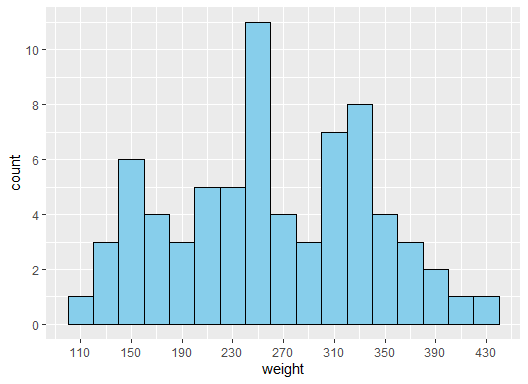
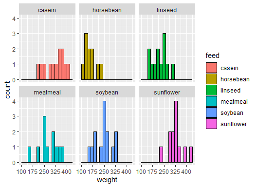

Visualizing Distributions 1
================

In this notebook I will be working with the `chickwts` dataset built
into R. This data set contains weight measurements of chicks fed on
different food sources to assess their effectiveness on growth rate.

``` r
head(chickwts)
```

    ##   weight      feed
    ## 1    179 horsebean
    ## 2    160 horsebean
    ## 3    136 horsebean
    ## 4    227 horsebean
    ## 5    217 horsebean
    ## 6    168 horsebean

**Viz 1:** Use ggplot to make a histogram of the `weight` column.
Manually choose appropriate values for `binwidth` and `center`. Explain
your choice of values in 2-3 sentences.

``` r
ggplot(chickwts, aes(weight)) +
  geom_histogram(binwidth = 20, center = 110, color= 'black', fill = 'skyblue') +
  scale_x_continuous( breaks= seq(from = 110, to = 450, by = 40) ) + 
  scale_y_continuous( breaks= seq(from = 0, to = 14, by = 2) )
```



Range of weights is from 108 to 423 lbs. The difference between the 5th
percentile (140.5) and the 95th percentile (385.0) is 244.5 lbs. The
sample size is 71. A bindiwth of 10 is spiky and doesn’t seem
representative as it shows many gaps in intermediate weights. A bindwith
of 20 lbs seems to be a reasonable quantity when talking about weights
and it is also 7% of the mean value.

**Viz 2:** Modify the plot from Problem 1 to show one panel per feed.
Hint: Use `facet_wrap()`.

``` r
ggplot(chickwts, aes(weight, fill = feed)) +
  geom_histogram(binwidth = 20, color = "black", center = 110) + facet_wrap(vars(feed)) + 
  scale_x_continuous( breaks= seq(from = 100, to = 450, by = 75) )
```


