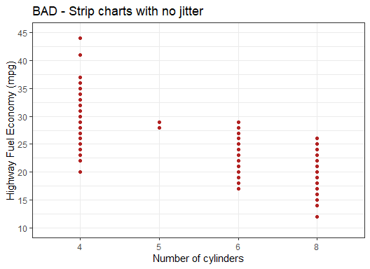
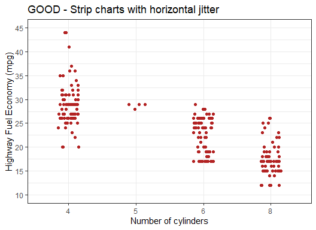
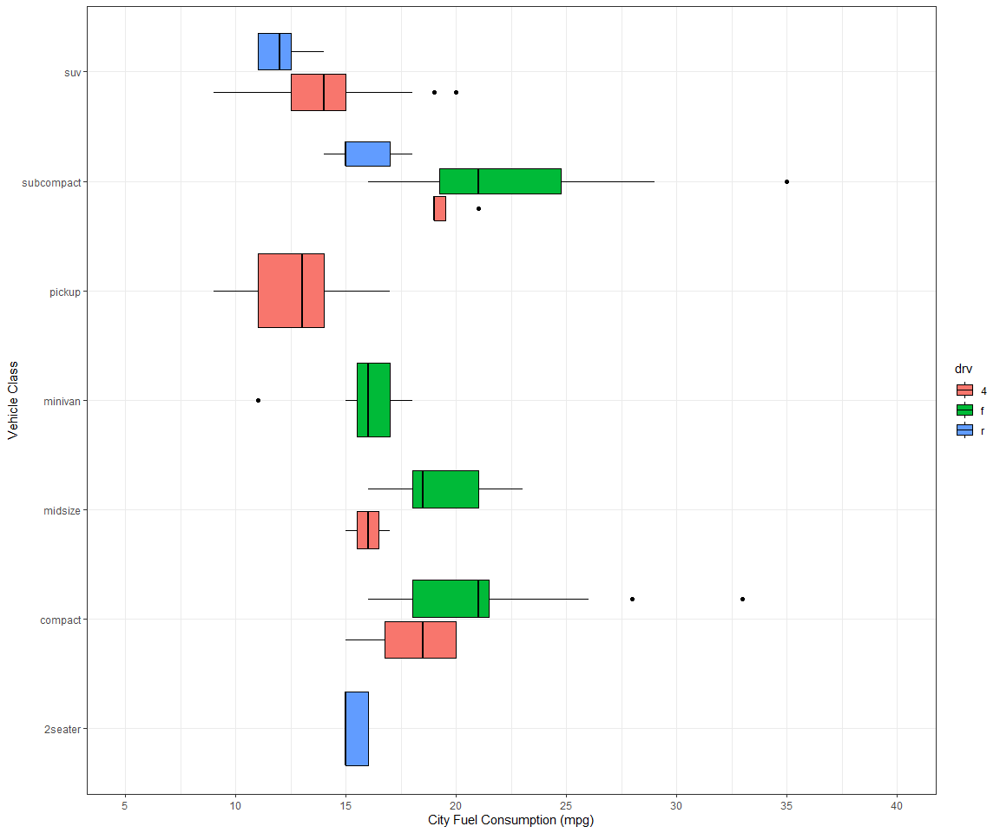
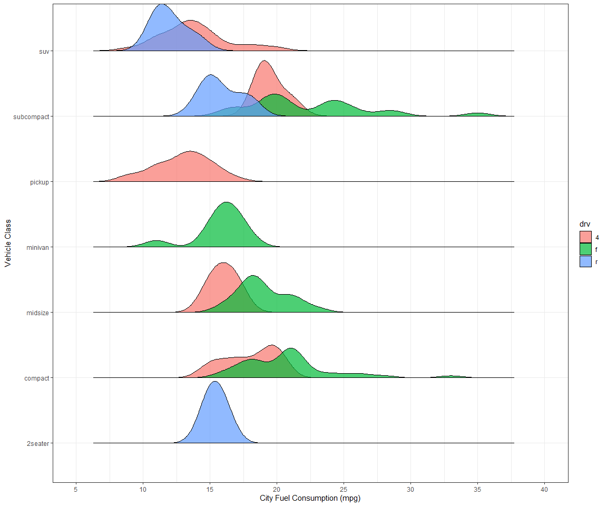
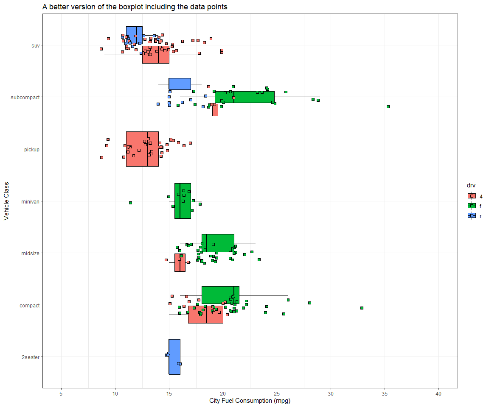

Visualizing Distributions 2
================

## STRIP CHARTS

**Viz 1:** We will work with the `mpg` dataset provided by **ggplot2**.

See here for details: <https://ggplot2.tidyverse.org/reference/mpg.html>

Below are two different strip charts of highway fuel economy versus
number of cylinders. The first one without horizontal jitter and second
one with horizontal jitter.

``` r
head(mpg)
```

    ## # A tibble: 6 × 11
    ##   manufacturer model displ  year   cyl trans      drv     cty   hwy fl    class 
    ##   <chr>        <chr> <dbl> <int> <int> <chr>      <chr> <int> <int> <chr> <chr> 
    ## 1 audi         a4      1.8  1999     4 auto(l5)   f        18    29 p     compa…
    ## 2 audi         a4      1.8  1999     4 manual(m5) f        21    29 p     compa…
    ## 3 audi         a4      2    2008     4 manual(m6) f        20    31 p     compa…
    ## 4 audi         a4      2    2008     4 auto(av)   f        21    30 p     compa…
    ## 5 audi         a4      2.8  1999     6 auto(l5)   f        16    26 p     compa…
    ## 6 audi         a4      2.8  1999     6 manual(m5) f        18    26 p     compa…

``` r
summary(mpg$hwy)
```

    ##    Min. 1st Qu.  Median    Mean 3rd Qu.    Max. 
    ##   12.00   18.00   24.00   23.44   27.00   44.00

``` r
print(unique(mpg$cyl))
```

    ## [1] 4 6 8 5

``` r
ggplot(mpg, aes(x = factor(cyl, level = c(4,5,6,8)), y = hwy)) +
  geom_point(size = 1.5, color = 'firebrick') + 
  labs(title = 'BAD - Strip charts with no jitter') + 
  xlab('Number of cylinders') + 
  scale_y_continuous(name = "Highway Fuel Economy (mpg)",
                     limits = c(10, 45),
                     breaks= seq(from = 10, to = 45, by = 5)) + 
  theme_bw()
```



``` r
ggplot(mpg, aes(x = factor(cyl, level = c(4,5,6,8)), y = hwy)) +
  geom_point(size = 1.5, 
             color = 'firebrick',
             position = position_jitter(width = 0.15, height =0)) + 
  labs(title = 'GOOD - Strip charts with horizontal jitter') + 
  xlab('Number of cylinders') + 
  scale_y_continuous(name = "Highway Fuel Economy (mpg)",
                     limits = c(10, 45),
                     breaks= seq(from = 10, to = 45, by = 5)) + 
  theme_bw()
```



The plot without jitter is highly misleading because many points
overlap, and we do not see the true number of data points contained in
the dataset. We are misled into thinking there are fewer points, and we
see a non-representative distribution of the data.

## BOXPLOTS vs RIDGELINES CHARTS

**Viz 2:** Visualize the distribution of each car’s city fuel economy by
class and type of drive train with (i) boxplots and (ii) ridgelines. In
both cases, put city mpg on the x axis and class on the y axis. Use
color to indicate the car’s drive train.

The boxplot ggplot generates will have a problem. Explain what the
problem is. (You do not have to solve it.)

``` r
mpg
```

    ## # A tibble: 234 × 11
    ##    manufacturer model      displ  year   cyl trans drv     cty   hwy fl    class
    ##    <chr>        <chr>      <dbl> <int> <int> <chr> <chr> <int> <int> <chr> <chr>
    ##  1 audi         a4           1.8  1999     4 auto… f        18    29 p     comp…
    ##  2 audi         a4           1.8  1999     4 manu… f        21    29 p     comp…
    ##  3 audi         a4           2    2008     4 manu… f        20    31 p     comp…
    ##  4 audi         a4           2    2008     4 auto… f        21    30 p     comp…
    ##  5 audi         a4           2.8  1999     6 auto… f        16    26 p     comp…
    ##  6 audi         a4           2.8  1999     6 manu… f        18    26 p     comp…
    ##  7 audi         a4           3.1  2008     6 auto… f        18    27 p     comp…
    ##  8 audi         a4 quattro   1.8  1999     4 manu… 4        18    26 p     comp…
    ##  9 audi         a4 quattro   1.8  1999     4 auto… 4        16    25 p     comp…
    ## 10 audi         a4 quattro   2    2008     4 manu… 4        20    28 p     comp…
    ## # … with 224 more rows

``` r
summary(mpg$cty)
```

    ##    Min. 1st Qu.  Median    Mean 3rd Qu.    Max. 
    ##    9.00   14.00   17.00   16.86   19.00   35.00

``` r
ggplot(mpg, aes(x = cty, y = class, fill = drv)) +
  geom_boxplot(color = 'black') +
  scale_x_continuous('City Fuel Consumption (mpg)', limits = c(5, 40),
                     breaks= seq(from = 5, to = 40, by = 5)) +
  ylab( "Vehicle Class") +
  theme_bw()
```



``` r
ggplot(mpg, aes(x = cty, y = class, fill = drv)) +
  geom_density_ridges2(color = 'black', alpha = 0.7, scale = 0.95, 
                       bandwidth = 0.9) +
  scale_x_continuous('City Fuel Consumption (mpg)', limits = c(5, 40),
                     breaks= seq(from = 5, to = 40, by = 5)) +
  ylab( "Vehicle Class") +
  theme_bw()
```


When using box-plots, we cannot see the underlying distribution of dots
in each group. They make or give the impression that distributions are
bell-shaped when instead, we cannot tell what the distribution is (it
could be bimodal, for example), and we are misled.

Furthermore, in groups with few data points, depending on the values, we
may or may not see the upper/lower fences, which only aids to confuse
the audience.

A better version of a box-plot chart is shown below. At least, it
provides the data points, so the audience can see past the summary
statistics.

I would argue the same about the ridgeline plot. While they provide a
better representation of the shape of the distribution, they would be
better with the overlaying data points so we can see how many points are
in each group.

``` r
ggplot(mpg, aes(x = cty, y = class, fill = drv)) +
  geom_boxplot(color = 'black', outlier.shape = NA) + 
  geom_point(aes( color = drv, fill = drv),  shape = 22, size = 2, color = "black", 
             position = position_jitter(height =0.2)) + 
  scale_x_continuous('City Fuel Consumption (mpg)', limits = c(5, 40),
                     breaks= seq(from = 5, to = 40, by = 5)) +
  ylab( "Vehicle Class") +
  labs(title = 'A better version of the boxplot including the data points') + 
  theme_bw()
```


