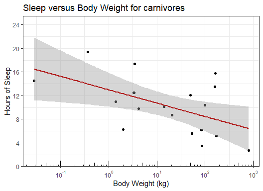
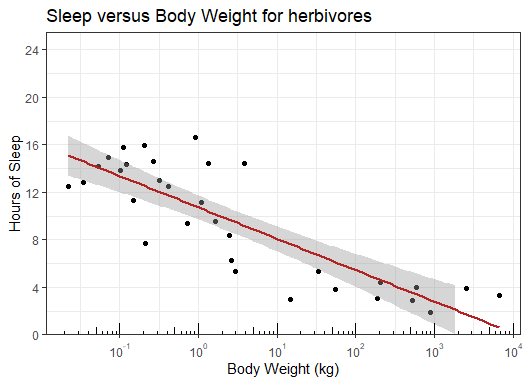
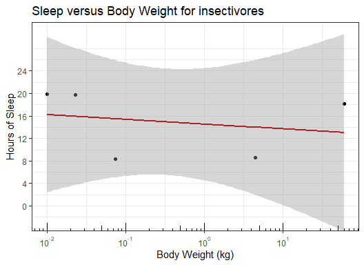
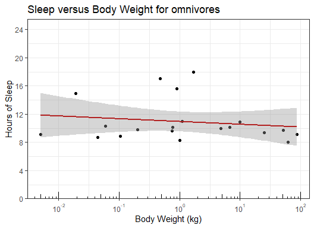

Mammals Sleep and Body Weight
================

## Data Loading and Inspection

The `msleep` dataset, provided by **ggplot2**, is used. See here for
details: <https://ggplot2.tidyverse.org/reference/msleep.html>

``` r
data <- msleep
head(data)
```

    ## # A tibble: 6 × 11
    ##   name  genus vore  order conse…¹ sleep…² sleep…³ sleep…⁴ awake  brainwt  bodywt
    ##   <chr> <chr> <chr> <chr> <chr>     <dbl>   <dbl>   <dbl> <dbl>    <dbl>   <dbl>
    ## 1 Chee… Acin… carni Carn… lc         12.1    NA    NA      11.9 NA        50    
    ## 2 Owl … Aotus omni  Prim… <NA>       17       1.8  NA       7    0.0155    0.48 
    ## 3 Moun… Aplo… herbi Rode… nt         14.4     2.4  NA       9.6 NA         1.35 
    ## 4 Grea… Blar… omni  Sori… lc         14.9     2.3   0.133   9.1  0.00029   0.019
    ## 5 Cow   Bos   herbi Arti… domest…     4       0.7   0.667  20    0.423   600    
    ## 6 Thre… Brad… herbi Pilo… <NA>       14.4     2.2   0.767   9.6 NA         3.85 
    ## # … with abbreviated variable names ¹​conservation, ²​sleep_total, ³​sleep_rem,
    ## #   ⁴​sleep_cycle

Columns in data set

``` r
names(data)
```

    ##  [1] "name"         "genus"        "vore"         "order"        "conservation"
    ##  [6] "sleep_total"  "sleep_rem"    "sleep_cycle"  "awake"        "brainwt"     
    ## [11] "bodywt"

## 1.0 Sleep annd Body Weight for *carnivores*

Visualize the relationship between total amount of sleep and body weight
in each mammal classified as a carnivore (`vore == "carni"`).

``` r
table(data$vore, useNA = "ifany")
```

    ## 
    ##   carni   herbi insecti    omni    <NA> 
    ##      19      32       5      20       7

``` r
carnivores <- data %>%
  filter(vore == "carni")
```

#### 1.1 `sleep_total`

``` r
summary(carnivores$sleep_total)
```

    ##    Min. 1st Qu.  Median    Mean 3rd Qu.    Max. 
    ##    2.70    6.25   10.40   10.38   13.00   19.40

#### 1.2 `bodywt`

``` r
summary(carnivores$bodywt)
```

    ##    Min. 1st Qu.  Median    Mean 3rd Qu.    Max. 
    ##   0.028   3.340  20.490  90.751  93.000 800.000

``` r
ggplot(carnivores, aes(x = bodywt, y = sleep_total)) +
  geom_point() +
  geom_smooth(method = 'lm', color = 'firebrick') +
  theme_bw() +
  xlab('Body Weight (kg)') +
  scale_y_continuous(
    'Hours of Sleep',
    breaks= seq(from = 0, to = 24, by = 4), 
    limits = c(0,24),
    expand = expansion(mult = c(0, 0.06))) + 
  scale_x_log10(
           breaks = scales::trans_breaks("log10", function(x) 10^x),
           labels = scales::trans_format("log10", scales::math_format(10^.x))) +
  labs(title = glue("Sleep versus Body Weight for carnivores")) +
  annotation_logticks(sides = 'b')
```

    ## `geom_smooth()` using formula 'y ~ x'


**Discussion**

The data suggest that large carnivores sleep less than small ones. A
whale is recorded as sleeping 2.7 hours and having a body weight of 800
kilograms, whereas a domestic cat is recorded as sleeping 12.5 hours for
a weight of 3.3 kilograms.

## 2.0 Automating Plot Creation

Creating a function to generate a plot for the other mammals

``` r
summary(data$bodywt)
```

    ##     Min.  1st Qu.   Median     Mean  3rd Qu.     Max. 
    ##    0.005    0.174    1.670  166.136   41.750 6654.000

``` r
make_vore_plot <- function(data, vore) {
  
  # This is a workaround for "insecti" whose band is above 24 hrs.
  if (vore == 'insecti') {
    yrange = NULL
    } else {
    yrange = c(0, 24)
    }

  # Data Filtering
  data %>%
      filter(.data$vore == .env$vore) %>%
      filter(!is.na(.data$sleep_total), !is.na(.data$bodywt)) %>%
    
      # Plotting
      ggplot( aes(x = bodywt, y = sleep_total)) +
        geom_point(na.rm = FALSE) +
        geom_smooth(
            method = 'lm', 
            color = 'firebrick',
            na.rm = FALSE) +
        theme_bw() +
        xlab('Body Weight (kg)') +
        scale_y_continuous(
            'Hours of Sleep',
            breaks= seq(from = 0, to = 24, by = 4),
            limits = yrange,
            expand = expansion(mult = c(0, 0.06))) +
 
        scale_x_log10(
           breaks = scales::trans_breaks("log10", function(x) 10^x),
           labels = scales::trans_format("log10", scales::math_format(10^.x))) +
        labs(title = glue("Sleep versus Body Weight for {vore}vores")) +
        annotation_logticks(sides = 'b')
  
}

make_vore_plot(msleep, "carni")
```

    ## `geom_smooth()` using formula 'y ~ x'


## 3.0 Sleep and Body Weight for all mammals

``` r
map2(list(msleep, msleep, msleep, msleep), c("carni", "herbi", "insecti", "omni"), make_vore_plot)
```

    ## [[1]]

    ## `geom_smooth()` using formula 'y ~ x'


    ## 
    ## [[2]]

    ## `geom_smooth()` using formula 'y ~ x'



    ## 
    ## [[3]]

    ## `geom_smooth()` using formula 'y ~ x'



    ## 
    ## [[4]]

    ## `geom_smooth()` using formula 'y ~ x'


**Discussion**

The data suggest that large mammals sleep less than small ones for all
vore types. There is a stronger correlation between sleep and body
weight for carnivores and herbivores. Carnivores tend to sleep more than
herbivores. Upon further research, a factor that affects how much animal
sleeps is whether the animal is a hunter or is hunted. Predators
(carnivores) such as lions and tigers get plenty of sleep; they have
little to fear. But animals that are prey, such as deer, tend to get
less sleep. They need to remain alert and aware of nearby predators. The
dataset supports that finding.

Insectivores show a relatively flat linear trend, and the sample size is
rather small to draw conclusions. Omnivores, which still follow the
general trend of larger weight leading to less sleep, interestingly
exhibit the largest values of sleep for medium size, around 1 kilogram.
