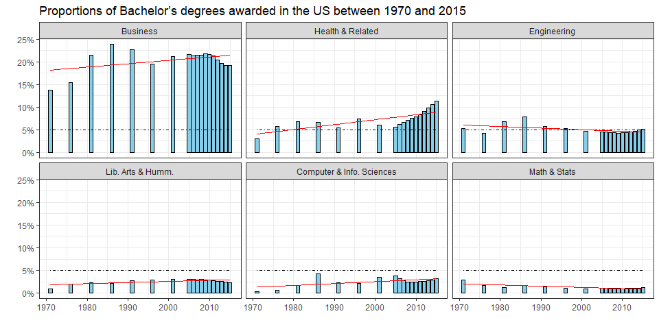
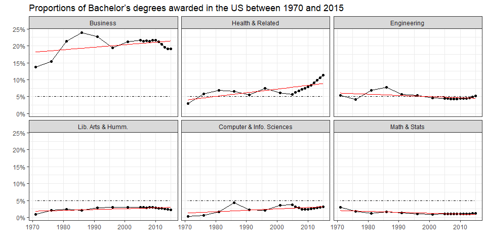
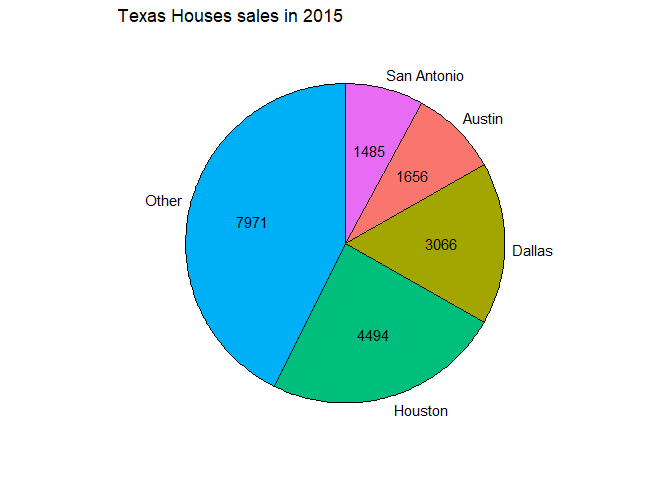

Visualizing Proportions
================

## **Problem 1: Bachelor’s degrees awarded in the US**

For this problem, we will work with the `BA_degrees` dataset. It
contains the proportions of Bachelor’s degrees awarded in the US between
1970 and 2015.

Plot a time series of the proportion of degrees (column `perc`) in this
field over time, using facets to show each field. Also plot a straight
line fit to the data for each field. You should modify the order of
facets to maximize figure appearance and memorability. What do you
observe?

**Hint:** To get started, see slides 34 to 44 in the class on getting
things into the right order:
<https://wilkelab.org/DSC385/slides/getting-things-in-order.html#34>

``` r
BA_degrees <- read_csv("https://wilkelab.org/SDS375/datasets/BA_degrees.csv")
BA_degrees
```

    ## # A tibble: 594 × 4
    ##    field                                              year  count     perc
    ##    <chr>                                             <dbl>  <dbl>    <dbl>
    ##  1 Agriculture and natural resources                  1971  12672 0.0151  
    ##  2 Architecture and related services                  1971   5570 0.00663 
    ##  3 Area, ethnic, cultural, gender, and group studies  1971   2579 0.00307 
    ##  4 Biological and biomedical sciences                 1971  35705 0.0425  
    ##  5 Business                                           1971 115396 0.137   
    ##  6 Communication, journalism, and related programs    1971  10324 0.0123  
    ##  7 Communications technologies                        1971    478 0.000569
    ##  8 Computer and information sciences                  1971   2388 0.00284 
    ##  9 Education                                          1971 176307 0.210   
    ## 10 Engineering                                        1971  45034 0.0536  
    ## # … with 584 more rows

### 1.1 Data Inspection

See unique fields

``` r
print(length(unique(BA_degrees$field)))
```

    ## [1] 33

``` r
for (p in unique(BA_degrees$field)) {
  cat(p, "; ")
}
```

    ## Agriculture and natural resources ; Architecture and related services ; Area, ethnic, cultural, gender, and group studies ; Biological and biomedical sciences ; Business ; Communication, journalism, and related programs ; Communications technologies ; Computer and information sciences ; Education ; Engineering ; Engineering technologies ; English language and literature/letters ; Family and consumer sciences/human sciences ; Foreign languages, literatures, and linguistics ; Health professions and related programs ; Homeland security, law enforcement, and firefighting ; Legal professions and studies ; Liberal arts and sciences, general studies, and humanities ; Library science ; Mathematics and statistics ; Military technologies and applied sciences ; Multi/interdisciplinary studies ; Parks, recreation, leisure, and fitness studies ; Philosophy and religious studies ; Physical sciences and science technologies ; Precision production ; Psychology ; Public administration and social services ; Social sciences and history ; Theology and religious vocations ; Transportation and materials moving ; Visual and performing arts ; Not classified by field of study ;

``` r
print(summary(BA_degrees$year))
```

    ##    Min. 1st Qu.  Median    Mean 3rd Qu.    Max. 
    ##    1971    1991    2006    2001    2011    2015

``` r
print(unique(BA_degrees$year))
```

    ##  [1] 1971 1976 1981 1986 1991 1996 2001 2005 2006 2007 2008 2009 2010 2011 2012
    ## [16] 2013 2014 2015

Check that fields add up to 1

``` r
BA_degrees %>% 
  group_by(year) %>%
  summarize(total = sum(perc))
```

    ## # A tibble: 18 × 2
    ##     year total
    ##    <dbl> <dbl>
    ##  1  1971     1
    ##  2  1976     1
    ##  3  1981     1
    ##  4  1986     1
    ##  5  1991     1
    ##  6  1996     1
    ##  7  2001     1
    ##  8  2005     1
    ##  9  2006     1
    ## 10  2007     1
    ## 11  2008     1
    ## 12  2009     1
    ## 13  2010     1
    ## 14  2011     1
    ## 15  2012     1
    ## 16  2013     1
    ## 17  2014     1
    ## 18  2015     1

### 1.2 Time Series

From the entire dataset, select a subset of 6 fields of study, using
arbitrary criteria.

``` r
fields_of_interest <- c("Health professions and related programs", 
                        "Liberal arts and sciences, general studies, and humanities", 
                        "Computer and information sciences", 
                        "Mathematics and statistics", 
                        "Business",  
                        "Engineering")

field_names <- as_labeller(
     c("Health professions and related programs" = 'Health & Related', 
        "Liberal arts and sciences, general studies, and humanities" = 'Lib. Arts & Humm.', 
        "Computer and information sciences" = "Computer & Info. Sciences",  
        "Mathematics and statistics" = "Math & Stats", 
        "Business" = "Business",  
        "Engineering" = "Engineering"))


BA_degrees_red <- BA_degrees %>% filter(field %in% fields_of_interest)
```

``` r
median_since_2010 = BA_degrees_red %>% 
                        filter(year >= 2010) %>%
                        group_by(field) %>%
                        summarize(ave_perc = median(perc)) %>%
                        arrange(desc(ave_perc))

(median_since_2010$field)
```

    ## [1] "Business"                                                  
    ## [2] "Health professions and related programs"                   
    ## [3] "Engineering"                                               
    ## [4] "Computer and information sciences"                         
    ## [5] "Liberal arts and sciences, general studies, and humanities"
    ## [6] "Mathematics and statistics"

``` r
# Create factor to help with later ordering
median_since_2010 <- factor(BA_degrees_red$field, levels=median_since_2010$field)

BA_degrees_red <- BA_degrees_red[order(median_since_2010),]
```

#### 1.2.1 Time Series with Bar Chart

``` r
BA_degrees_red %>% 
    mutate(field = fct_reorder(field, -perc)) %>% # default: order by median
    ggplot(aes(x = year, y = perc)) + 
    geom_col(fill = 'skyblue', color = 'black') + 
    geom_line(aes(y = 0.05), color = "black", linetype = 4, size = 0.7) +
    geom_smooth(method=lm, se=FALSE, col='red', size = 0.6 ) +
    facet_wrap(vars(field), nrow = 2, ncol = 3, labeller = field_names) + 
    scale_y_continuous(labels = scales::percent, "") + 
    labs(title = 'Proportions of Bachelor’s degrees awarded in the US between 1970 and 2015') +
    xlab("") +
    theme_bw() 
```

    ## `geom_smooth()` using formula 'y ~ x'

<!-- -->

#### 1.2.2 Time Series with Line Chart

``` r
BA_degrees_red %>% 
    mutate(field = fct_reorder(field, -perc)) %>% # default: order by median
    ggplot(aes(x = year, y = perc)) + 
    geom_line() + 
    geom_point() +
    geom_line(aes(y = 0.05), color = "black", linetype = 4, size = 0.7) +
    geom_smooth(method=lm, se=FALSE, col='red', size = 0.6 ) +
    facet_wrap(vars(field), nrow = 2, ncol = 3, labeller = field_names) + 
    scale_y_continuous(labels = scales::percent, "") + 
    labs(title = 'Proportions of Bachelor’s degrees awarded in the US between 1970 and 2015') +
    xlab("") +
    theme_bw() 
```

    ## `geom_smooth()` using formula 'y ~ x'

<!-- -->

*Observations:*

It is noted that the six degrees selected in the time series were
arbitrarily chosen from the dataset to include majors of interest for
the author of this notebook. Moreover, the degrees are ordered from left
to right and top to bottom in decreasing order based on the median
percentage values of degrees awarded between 2010 to 2015 (the latest
available date).

Among these 6 degrees, business degrees have consistently represented,
since the 1970s, the largest proportion of degrees awarded in the US.
The proportion of business degrees has been about 20% since whereas the
proportion for Lib. Arts & Humm, Computer & Info. Sciences and Math &
Stats is about 2.5% or less. Health & Related degrees accounted for
about 5% until 2001 and have risen considerably since then, reaching
over 10% of the total degrees awarded. Engineering degrees have
consistently represented about 5% of the total degrees awarded, and
since 2005 its proportion has been almost constant.

Linear regression models were fitted to each of the degrees selected.

- Business, Health & Related, Lib. Arts & Humm, and Computer & Info.
  Sciences exhibit an increase in proportion while
- Engineering and Math & Stats exhibit a negative trend in proportion
  between 1970-2015.

The steepest slope (hence the largest rate of change) is for Health &
Related degrees, which shows a significant increase in proportion since
2015.

## **Problem 2: Texas Housing**

We will work the `txhousing` dataset provided by **ggplot2**. See here
for details: <https://ggplot2.tidyverse.org/reference/txhousing.html>

Consider the number of houses sold in January 2015. There are records
for 46 different cities:

``` r
txhousing_jan_2015 <- txhousing %>% 
  filter(year == 2015 & month == 1) %>% 
  arrange(desc(sales))

head(txhousing_jan_2015)
```

    ## # A tibble: 6 × 9
    ##   city           year month sales     volume median listings inventory  date
    ##   <chr>         <int> <int> <dbl>      <dbl>  <dbl>    <dbl>     <dbl> <dbl>
    ## 1 Houston        2015     1  4494 1155508809 189300    18649       2.7  2015
    ## 2 Dallas         2015     1  3066  773952769 203300     9063       1.8  2015
    ## 3 Austin         2015     1  1656  512034244 237500     5567       2.2  2015
    ## 4 San Antonio    2015     1  1485  311909130 175900     7717       3.6  2015
    ## 5 Collin County  2015     1   776  242496585 268000     1780       1.3  2015
    ## 6 Fort Bend      2015     1   686  203621920 260300     2414       2.3  2015

Pie chart of the `txhousing_jan_2015` dataset, but showing only the four
cities with the most sales, plus all others lumped together into
“Other”.

``` r
# data preparation
top_four <- txhousing_jan_2015$sales[1:4]

txhousing_lumped <- txhousing_jan_2015 %>%
  mutate(city = ifelse(sales %in% top_four, city, "Other")) %>% 
  group_by(city) %>%
  summarize(sales = sum(sales))

txhousing_lumped_for_pie <- 
  txhousing_lumped %>%
      arrange(sales) %>%
      mutate(
        end_angle = 2*pi*cumsum(sales)/sum(sales), #ending angle for each pie slice
        start_angle = lag(end_angle, default =0), # starting angle for each pie slice
        mid_angle = 0.5*(start_angle + end_angle), # middle of each pie slice, for text labels
        
        # Horizontal and Vertical justifications for outer labels
        hjust = ifelse(mid_angle > pi, 1, 0),
        vjust = ifelse(mid_angle < pi/2 | mid_angle > 3*pi/2, 0, 1)
      )
txhousing_lumped_for_pie
```

    ## # A tibble: 5 × 7
    ##   city        sales end_angle start_angle mid_angle hjust vjust
    ##   <chr>       <dbl>     <dbl>       <dbl>     <dbl> <dbl> <dbl>
    ## 1 San Antonio  1485     0.500       0         0.250     0     0
    ## 2 Austin       1656     1.06        0.500     0.778     0     0
    ## 3 Dallas       3066     2.09        1.06      1.57      0     1
    ## 4 Houston      4494     3.60        2.09      2.84      0     1
    ## 5 Other        7971     6.28        3.60      4.94      1     0

``` r
ggplot(txhousing_lumped_for_pie) + 
  aes(x0 = 0, y0=0, r0=0, r =1,
      start = start_angle, end = end_angle,
      fill = city) + 
  geom_arc_bar(show.legend = FALSE) +
  geom_text(aes(x = 0.6 * sin(mid_angle),
                y = 0.6 * cos(mid_angle),
                label = sales)) + 
  geom_text(aes(x = 1.05* sin(mid_angle),
                y = 1.05* cos(mid_angle),
                label = city,
                hjust = hjust, 
                vjust = vjust)) +
  coord_fixed(xlim = c(-1.3, 1.3), ylim = c(-1.2, 1.2)) + 
  labs(title = 'Texas Houses sales in 2015') +
  scale_y_continuous(breaks = NULL, name="") + 
  scale_x_continuous(breaks = NULL, name="") +
  theme(panel.background = element_rect(fill = 'white', colour = NULL))
```

<!-- -->
